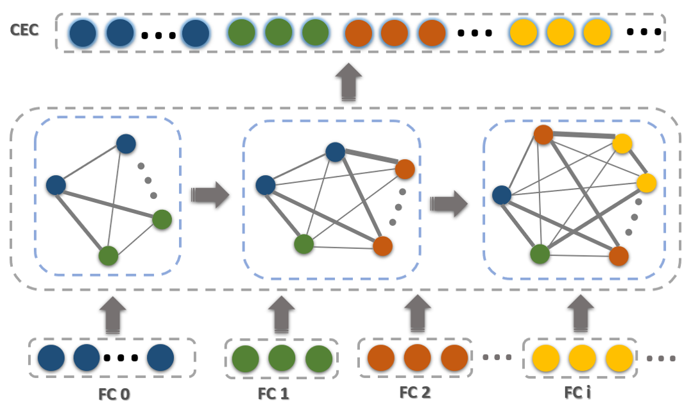
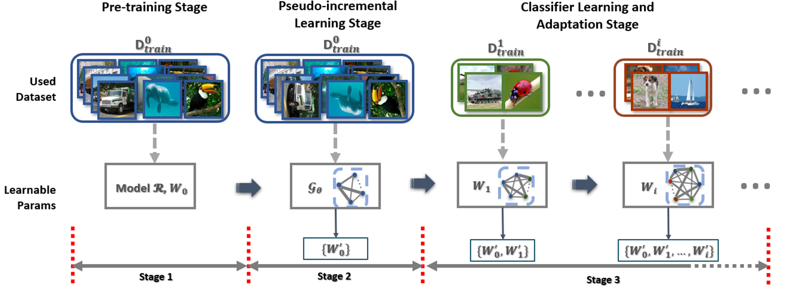
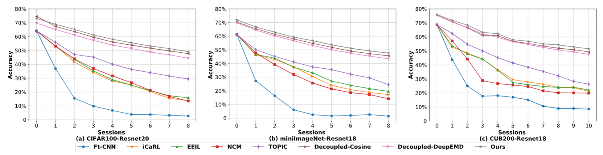

# Few-Shot Incremental Learning with Continually Evolved Classifiers

PyTorch implementation of Few-Shot Incremental Learning with Continually Evolved Classifiers
[Paper](https://arxiv.org/abs/2104.03047)

If you use the code in this repo for your work, please cite the following bib entries:

    @InProceedings{Zhang_2021_CVPR,
        author = {Zhang, Chi and Song, Nan and Lin, Guosheng and Zheng, Yun and Pan, Pan and Xu, Yinghui},
        title = {Few-Shot Incremental Learning with Continually Evolved Classifiers},
        booktitle = {IEEE/CVF Conference on Computer Vision and Pattern Recognition (CVPR)},
        month = {June},
        year = {2021}
        }
## Abstract
Few-shot class-incremental learning (FSCIL) aims to design machine learning algorithms that can continually learn new concepts from a few data points, without forgetting knowledge of old classes. The difficulty lies in that limited data from new classes not only lead to significant overfitting issues but also exacerbate the notorious catastrophic forgetting problems. Moreover, as training data come in sequence in FSCIL, the learned classifier can only provide discriminative information in individual sessions, while FSCIL requires all classes to be involved for evaluation. In this paper, we address the FSCIL problem from two aspects. First, we adopt a simple but effective decoupled learning strategy of representations and classifiers that only the classifiers are updated in each incremental session, which avoids knowledge forgetting in the representations. By doing so, we demonstrate that a pre-trained backbone plus a non-parametric class mean classifier can beat state-of-the-art methods. Second, to make the classifiers learned on individual sessions applicable to all classes, we propose a Continually Evolved Classifier (CEC) that employs a graph model to propagate context information between classifiers for adaptation. To enable the learning of CEC, we design a pseudo incremental learning paradigm that episodically constructs a pseudo incremental learning task to optimize the graph parameters by sampling data from the base dataset. Experiments on three popular benchmark datasets, including CIFAR100, miniImageNet, and Caltech-USCD Birds-200-2011 (CUB200), show that our method significantly outperforms the baselines and sets new state-of-the-art results with remarkable advantages.

Continually Evolved Classifier

## Pipline
The whole learning pipline of our model:

## Results

Detailed numbers can be found in the [Supplementary Material](https://arxiv.org/pdf/2104.03047)

## Requirements
- [PyTorch >= version 1.1](https://pytorch.org)
- tqdm

## Datasets and pretrained models
We follow [FSCIL](https://github.com/xyutao/fscil) setting to use the same data index_list for training.  
For CIFAR100, the dataset will be download automatically.  
For miniImagenet and CUB200, you can download from [here](https://drive.google.com/drive/folders/11LxZCQj2FRCs0JTsf_dafvTHqFn2yGSN?usp=sharing). Please put the downloaded file under `data/` folder and unzip it:
    
    $ tar -xvf miniimagenet.tar 
    $ tar -xvzf CUB_200_2011.tgz

You can find pretrained models from [here](https://drive.google.com/drive/folders/1ZLQJYJ9IkXcVu7v525oCcJGE-zeJAGF_?usp=sharing). Please download the whole params folder and put under your local CEC project path

## Training scripts
cifar100

    $ python train.py -project cec -dataset cifar100 -epochs_base 100 -episode_way 15 -episode_shot 1 -low_way 15 -low_shot 1 -lr_base 0.002 -lrg 0.0002 -step 20 -gamma 0.5 -gpu 0,1,2,3 -model_dir params/cifar100/session0_max_acc7455_cos.pth

mini_imagenet

    $ python train.py -project cec -dataset mini_imagenet -epochs_base 100 -episode_way 15 -episode_shot 1 -low_way 15 -low_shot 1 -lr_base 0.0002 -lrg 0.0002 -step 20 -gamma 0.5 -gpu 0,1,2,3 -model_dir params/miniimagenet/session0_max_acc70367_cos.pth

cub200

    $ python train.py -project cec -dataset cub200 -epochs_base 100 -episode_way 15 -episode_shot 1 -episode_query 10 -low_way 15 -low_shot 1 -lr_base 0.0002 -lrg 0.0002 -step 20 -gamma 0.5 -gpu 0,1,2,3 -model_dir params/cub200/session0_max_acc7552_cos.pth

## Pretrain scripts
cifar100

    $python train.py -project base -dataset cifar100  -base_mode 'ft_cos' -new_mode 'avg_cos' -gamma 0.1 -lr_base 0.1 -lr_new 0.1 -decay 0.0005 -epochs_base 100 -schedule Milestone -milestones 60 70 -gpu 0,1,2,3 -temperature 16
    
mini_imagenet

    $python train.py -project base -dataset mini_imagenet -base_mode 'ft_cos' -new_mode 'avg_cos' -gamma 0.1 -lr_base 0.1 -lr_new 0.1 -decay 0.0005 -epochs_base 100 -schedule Milestone -milestones 40 70 -gpu 0,1,2,3 -temperature 16

cub200
    
    $python train.py -project base -dataset cub200 -base_mode 'ft_cos' -new_mode 'avg_cos' -gamma 0.1 -lr_base 0.1 -lr_new 0.1 -decay 0.0005 -epochs_base 100 -schedule Milestone -milestones 30 40 60 80 -gpu '0,1,2,3' -temperature 16
## Acknowledgment
Our project references the codes in the following repos.

- [fscil](https://github.com/xyutao/fscil)
- [DeepEMD](https://github.com/icoz69/DeepEMD)
- [FEAT](https://github.com/Sha-Lab/FEAT)